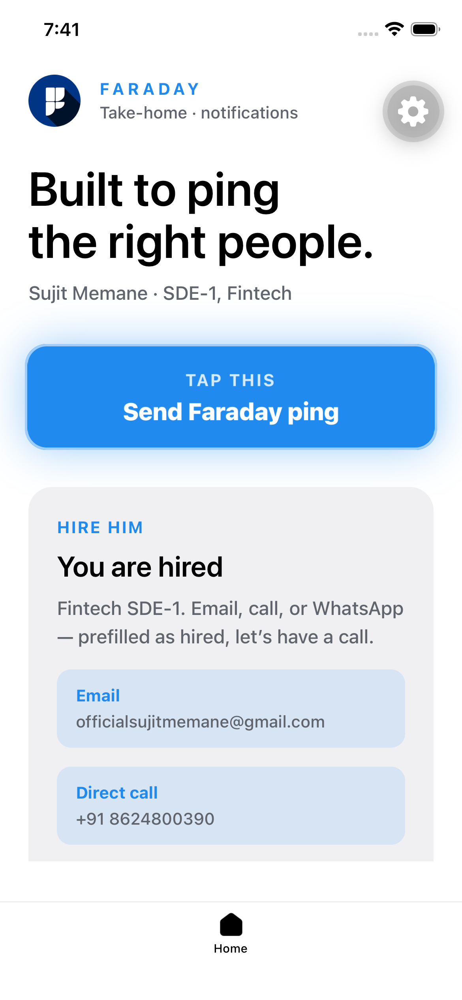
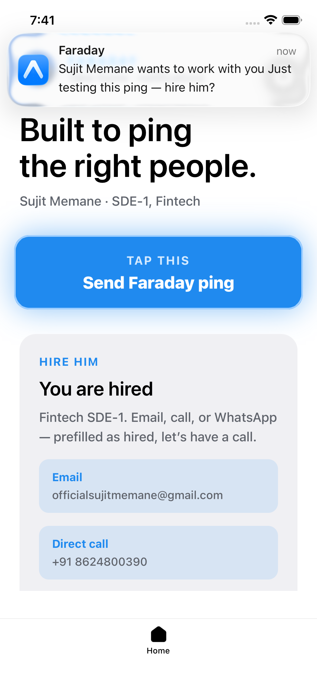

# Faraday

Expo take-home: tap **Send Faraday ping** → permission (if needed) → a **local** notification with title `Faraday`, custom `notification.wav`, and a hire-me body.

<p align="center">
  
</p>

**APK:** [Download the Faraday Assignment APK](https://we.tl/t-OFN6Obr2JJNXbabk)

**Repo:** [github.com/sujitmemane/faraday-assignment](https://github.com/sujitmemane/faraday-assignment)  
**EAS project:** `9ed9f7a8-c361-47d8-814b-8332cbf627ea`  
**Bundle / package:** `com.sujeethmemane.faradayassignment`

## Screenshots

| Home (ping + hire) | Notification |
| --- | --- |
|  |  |

## What it does

- **Foreground handler** (`Notifications.setNotificationHandler`) — banner + list, sound on, no badge.
- **Permission** — `getPermissionsAsync` / `requestPermissionsAsync` before scheduling.
- **Local trigger** — `scheduleNotificationAsync`. iOS: `trigger: null` (immediate). Android: 1s interval on channel `faraday-ping` so custom sound works on 8+.
- **Custom sound** — `assets/notification.wav` in the `expo-notifications` plugin; play with `sound: 'notification.wav'` (filename only, do not `require()` it).
- **Hire actions** — [email](mailto:officialsujitmemane@gmail.com), [call](tel:+918624800390), [WhatsApp](https://wa.me/918624800390?text=You%27re%20hired%20%E2%80%94%20let%27s%20have%20a%20call).

This is **on-device** scheduling. It does not send FCM/APNs pushes yet; remote is below.

## Stack

Expo 57 · React Native 0.86 · expo-router · expo-notifications · expo-dev-client · EAS Build

## How the ping is triggered

1. Tap **Send Faraday ping**.
2. Read permission; request if not granted.
3. Android: channel `faraday-ping` with `notification.wav`.
4. `scheduleNotificationAsync` posts the notification.
5. The handler decides foreground presentation (`shouldShowBanner`, `shouldPlaySound`).

```json
["expo-notifications", { "sounds": ["./assets/notification.wav"] }]
```

## Adding remote (push) notifications

Same library. You still need **credentials + a push token + something that sends**.

1. **Credentials** — `eas credentials` (FCM / APNs) for this EAS project.
2. **Device** — physical phone or Android emulator with Google Play. Remote push on Android is not in Expo Go from SDK 53; use a dev/preview build.
3. **Token** after permission:

```ts
import * as Notifications from 'expo-notifications';
import Constants from 'expo-constants';

const projectId = Constants.expoConfig?.extra?.eas?.projectId;
const { data: token } = await Notifications.getExpoPushTokenAsync({ projectId });
// POST token to your backend
```

4. **Send** via the [Expo Push API](https://docs.expo.dev/push-notifications/sending-notifications/) or FCM/APNs.
5. **Tap / receive** — `addNotificationReceivedListener` / `addNotificationResponseReceivedListener`.
6. **Android 13+** — create a channel before `getExpoPushTokenAsync` (this app already uses `faraday-ping`).

Later: plugin `icon` + `color`, categories, badge, deep links (`faradayassignment://`).

## Project map

| Path | Role |
| --- | --- |
| `src/app/index.tsx` | Home: ping, hire links, local schedule |
| `src/app/_layout.tsx` | Tabs + splash overlay |
| `src/components/animated-icon.tsx` | In-app splash (`icon.png`) |
| `assets/notification.wav` | Custom notification sound |
| `assets/images/icon.png` | App icon, splash, Android adaptive foreground |
| `app.json` | Plugins, icons, EAS `projectId` |

## Contact

**Sujit Memane** · SDE-1, Fintech

- Email: [officialsujitmemane@gmail.com](mailto:officialsujitmemane@gmail.com?subject=You%27re%20hired)
- Call: [+91 8624800390](tel:+918624800390)
- WhatsApp: [wa.me/918624800390](https://wa.me/918624800390?text=You%27re%20hired%20%E2%80%94%20let%27s%20have%20a%20call)

You're hired — let's have a call.
